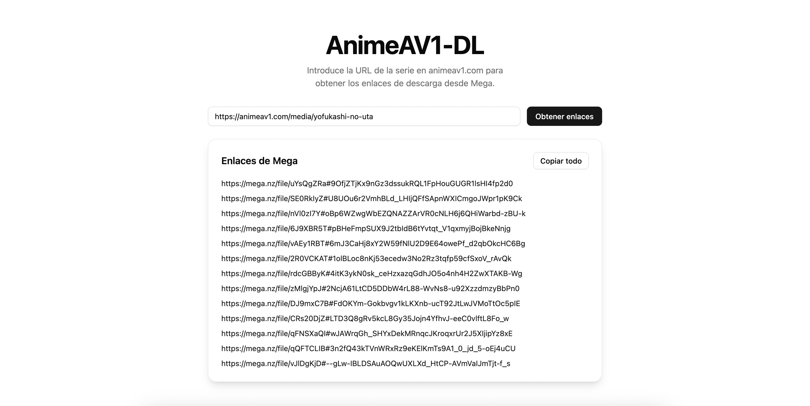

# AnimeAV1 Downloader

Herramienta en línea de comandos para extraer enlaces de descarga de animeav1.com.



## Requisitos

- Go 1.21 o superior
- Chrome/Chromium (se ejecuta en modo headless, no requiere interfaz gráfica)

### Instalación de Chrome/Chromium

#### macOS
```bash
brew install chromium
```

#### Ubuntu/Debian
```bash
apt-get update && apt-get install -y chromium-browser
```

#### Arch Linux
```bash
pacman -S chromium
```

## Instalación

1. Clona el repositorio:
```bash
git clone https://github.com/magonxesp/animeav1-dl.git
cd animeav1-dl
```

2. Instala las dependencias:
```bash
go mod download
```

3. Compila el programa:
```bash
go build
```

## Uso

### CLI

#### Listar link de descarga de todos los episodios de una serie

```bash
./animeav1-dl --url "https://animeav1.com/media/yofukashi-no-uta"
```

## Notas técnicas

- El programa utiliza Chrome/Chromium en modo headless (sin interfaz gráfica) para procesar páginas que requieren JavaScript.
- No es necesario tener una pantalla o servidor X ejecutándose, ya que el navegador se ejecuta completamente en segundo plano.
- Los enlaces de descarga se extraen automáticamente después de simular la interacción con los botones necesarios.

## Despliegue en servidor

Para ejecutar en un servidor, asegúrate de tener Chrome/Chromium instalado. El programa está diseñado para funcionar sin interfaz gráfica, por lo que es adecuado para servidores sin entorno gráfico.

### Usando Docker

1. Construye la imagen:
```bash
docker build -t animeav1-dl .
```

2. Ejecuta el contenedor:
```bash
docker run animeav1-dl --url "https://animeav1.com/media/yofukashi-no-uta"
```

## Desarrollo

### Ejecutar tests
```bash
go test -v
```

Los tests incluyen la verificación de:
- Extracción de lista de episodios
- Extracción de enlaces de descarga
- Manejo de errores
